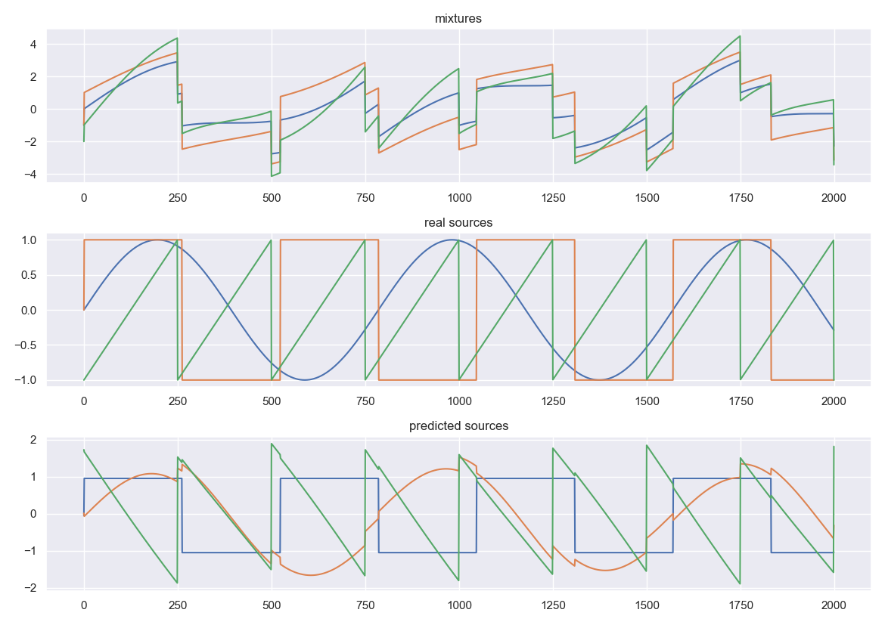

This is an Independent Component Analysis python program designed with a team of computer science students. 
The essay details the mathematics and science behind the procedures, and the code is well-documented and commented all throughout.

